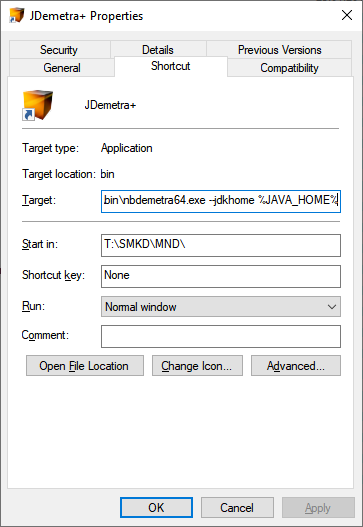

# Java

## Why is Java needed? 

Java is necessary for the operation of several programs, for example: 

- [JDemetra+](https://github.com/jdemetra/jdemetra-app/releases)
- [RJdemetra](https://jdemetra.github.io/rjdemetra/)
- [μ-ARGUS](http://research.cbs.nl/casc/mu.htm)
- [τ-ARGUS](http://research.cbs.nl/casc/tau.htm)
- [rJava](http://rforge.net/rJava/)


## JRE un JDK

JRE is the *Java Runtime Environment*. JDK is the *Java Development Kit*. Java developers need JDK, Java users only need JRE.

## Open Java

The Java source code is freely available, but compiled Java is required in practice. There are several Java providers. For example:

- [AdoptOpenJDK](https://adoptopenjdk.net/)
- [Amazon Corretto](https://aws.amazon.com/corretto/)
- [Zulu JDK](https://www.azul.com/downloads/zulu/)

Theoretically, it doesn't matter which Open Java version is used, as they are all compiled from the same source code. However, small differences are possible in practice. Therefore, it would be good if employees working on one project choose the same Open Java release.

# Installation

## Function `install.open.jre`

The installation of Open JRE can be done by the user. Administrator assistance is not required. To facilitate the installation of Open JRE, an R function called install.open.jre has been prepared. With the help of this R function, it is possible to install Java from Amazon or Zulu provider. See the install-openJRE.R file. The function performs the following installation steps:

- The user-specified Java version (zip file) is downloaded from the selected provider's website. 
- The file is checked with a checksum. Only in the case of Amazon.
- The contents of the zip file are extracted.
- By default, the environment variable (*environment variable*) `JAVA_HOME` is defined. This can be turned off with the `set.env.variable = FALSE` function argument.


By default, files are saved in the directory `C:\Users\[user]\Documents\OpenJRE`. The directory for saving files can be changed with the `path.jre` function argument. Existing files are overwritten, but each JRE version has its own directory.


Java providers can be selected using the function parameter `provider`. Possible values are:

- `amazon`: installs Amazon Corretto,
- `zulu`: installs Zulu JDK.

It is possible to install different versions of Java. Java 7, 8, 11, and 17 are LTS (*long term support*) versions.

## The environment variable `JAVA_HOME`

A large part of programs, such as R and R packages, locate user-installed Java through the `JAVA_HOME` environment variable. In this case, no additional actions are necessary. Just restart R or RStudio and the installed Java will be available.

## Test

The OpenJRE installation can be checked from the command prompt (*Command Prompt*) using the following commands:

`echo %JAVA_HOME%` displays the OpenJRE installation directory.

```
C:\Users\[user]>echo %JAVA_HOME%
C:\Users\[user]\Documents\OpenJRE\jre8
```

`%JAVA_HOME%\bin\java -version` displays the installed Java version.

```
C:\Users\[user]>%JAVA_HOME%\bin\java -version
openjdk version "1.8.0_222"
OpenJDK Runtime Environment Corretto-8.222.10.3 (build 1.8.0_222-b10)
OpenJDK 64-Bit Server VM Corretto-8.222.10.3 (build 25.222-b10, mixed mode)
```

# JDemetra+

Not all programs use the `JAVA_HOME` environment variable, such as JDemetra+. To let JDemetra+ know where to find the user-installed Java, a shortcut to the `..\nbdemetra\bin\nbdemetra64.exe` file must be created. The shortcut should include the additional argument `--jdkhome %JAVA_HOME%`. Thus, the shortcut should be formatted similarly to `..\nbdemetra\bin\nbdemetra64.exe --jdkhome %JAVA_HOME%`. See the image.


