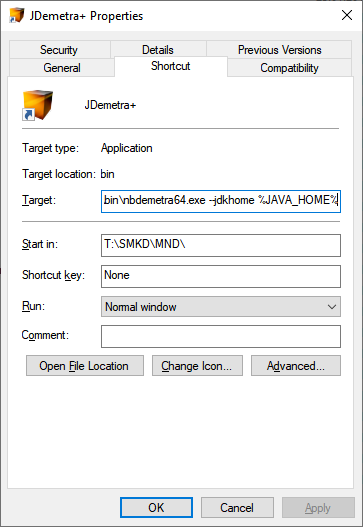

# Java

## Kāpēc ir vajadzīga Java?

Java ir nepieciešama vairāku programmu darbībai, piemēram:

- [JDemetra+](https://github.com/jdemetra/jdemetra-app/releases)
- [RJdemetra](https://jdemetra.github.io/rjdemetra/)
- [μ-ARGUS](http://research.cbs.nl/casc/mu.htm)
- [τ-ARGUS](http://research.cbs.nl/casc/tau.htm)
- [rJava](http://rforge.net/rJava/)


## JRE un JDK

JRE ir *Java Runtime Environment*. JDK ir *Java Development Kit*. Java izstrādātājiem ir nepieciešams JDK, Java lietotājiem pietiek ar JRE.


## Open Java

Java pirmkods ir brīvi lietojams, bet praksē ir nepieciešama kompilēta Java. Ir vairāki Java provaideri, kā piemēram:

- [AdoptOpenJDK](https://adoptopenjdk.net/)
- [Amazon Corretto](https://aws.amazon.com/corretto/)
- [Zulu JDK](https://www.azul.com/downloads/zulu/)

Teorētiski ir vienalga, kura Open Java versija tiek lietota, jo tās visas ir kompilētas no vienu un tā paša pirmkoda. Kaut gan praksē nelielas atšķirības ir iespējamas. Tāpēc būtu labi, ja darbinieki, kas strādā pie viena projekta izvēlētos vienu un to pašu Open Java relīzi.


# Instalācija

## Funkcija `install.open.jre`

Open JRE instalāciju var veikt lietotājs. Nav vajadzīga administratora palīdzība. Lai atvieglotu Open JRE instalāciju, ir sagatavota R funkcija `install.open.jre`. Ar R funkcijas palīdzību ir iespēja instalēt Javu no Amazon vai Zulu provaidera. Skatīt failu `install-openJRE.R`. Funkcija veic sekojošus instalācijas soļus:

- No izvēlētā provaidera mājas lapas tiek lejupielādēta lietotāja norādītā Java versija (zip fails).
- Tiek vaikta faila pārbaude ar pārbaudes summu. Tikai Amazon gadījumā.
- Tiek atarhivēts zip faila saturs.
- Pēc noklusējuma tiek definēts vides mainīgais (*environment variable*) `JAVA_HOME`. Šo var atslēgt ar funkcijas argumentu `set.env.variable = FALSE`.

Pēc noklusējuma faili tiek saglabāti mapē `C:\Users\[user]\Documents\OpenJRE`. Failu saglabāšanas mapi var mainīt ar funkcijas argumentu `path.jre`. Esošie faili tiek pārrakstīti, bet katrai JRE versijai ir sava mape.

Java provaideri var izvēlēties ar funkcijas parametru `provider`. Iespējamās vērtības ir:

- `amazon`: instalēs Amazon Corretto,
- `zulu`: instalēs Zulu JDK.

Ir iespējams instalēt dažādākas Java versijas. Javas 7, 8, 11 un 17 ir LTS (*long term support*) versijas.


## Vides mainīgais `JAVA_HOME`

Liela daļa programmu, piemēram, R un R pakotnes, lietotāja instalētu Java atrod pēc vides mainīgā (*environment variable*) `JAVA_HOME`. Šādā gadījumā vairs nekādas papildus darbības nav nepieciešamas. Atliek pārstartēt R vai RStudio un installētā Java būs pieejama.


## Pārbaude

OpenJRE instalāciju var pārbaudīt no komandrindas (*Command Prompt*) ar sekojošām komandām:

`echo %JAVA_HOME%` parāda OpenJRE instalācijas mapi.

```
C:\Users\MLiberts>echo %JAVA_HOME%
C:\Users\MLiberts\Documents\OpenJRE\jre8
```

`%JAVA_HOME%\bin\java -version` parāda instalēto Java versiju.

```
C:\Users\MLiberts>%JAVA_HOME%\bin\java -version
openjdk version "1.8.0_222"
OpenJDK Runtime Environment Corretto-8.222.10.3 (build 1.8.0_222-b10)
OpenJDK 64-Bit Server VM Corretto-8.222.10.3 (build 25.222-b10, mixed mode)
```


# JDemetra+

Ne visas programmas izmanto vides mainīgo `JAVA_HOME`, piemēram, JDemetra+. Lai JDemetra+ zinātu, kur meklēt lietotāja instalēto Java, ir jāizveido īsceļš (*shortcut*) uz failu `..\nbdemetra\bin\nbdemetra64.exe`. Īsceļā ir jānorāda papildus arguments `--jdkhome %JAVA_HOME%`. Attiecīgi īsceļam ir jābūt noformētam līdzīgi `..\nbdemetra\bin\nbdemetra64.exe --jdkhome %JAVA_HOME%`. Skatīt attēlu.


